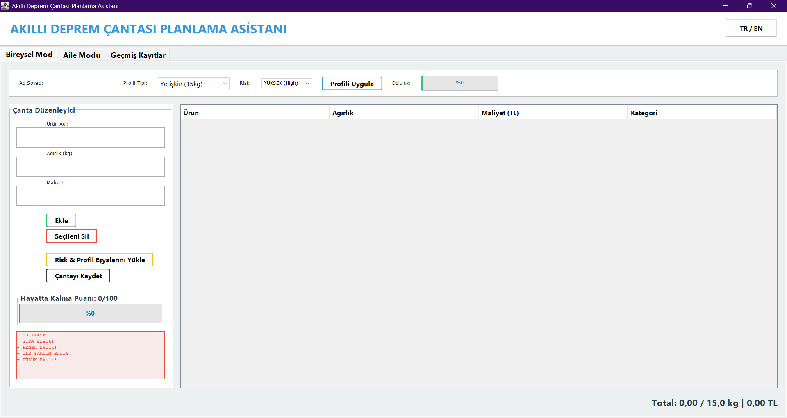
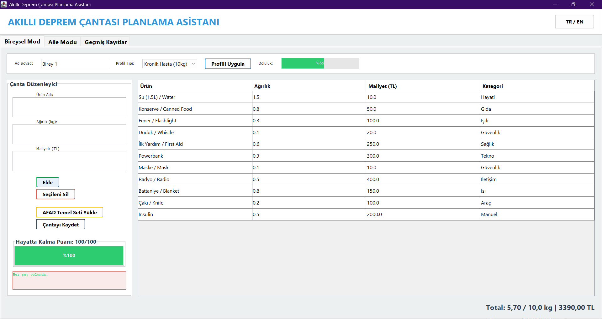
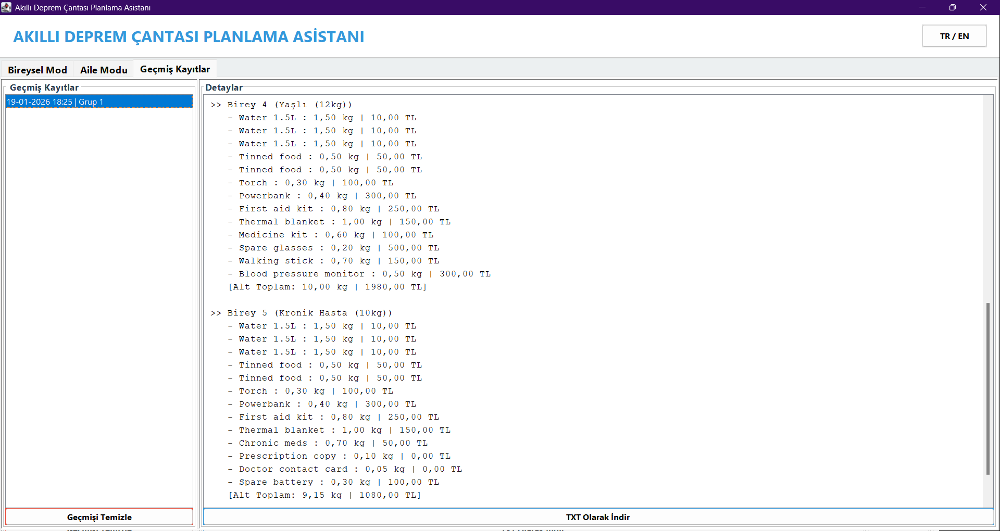
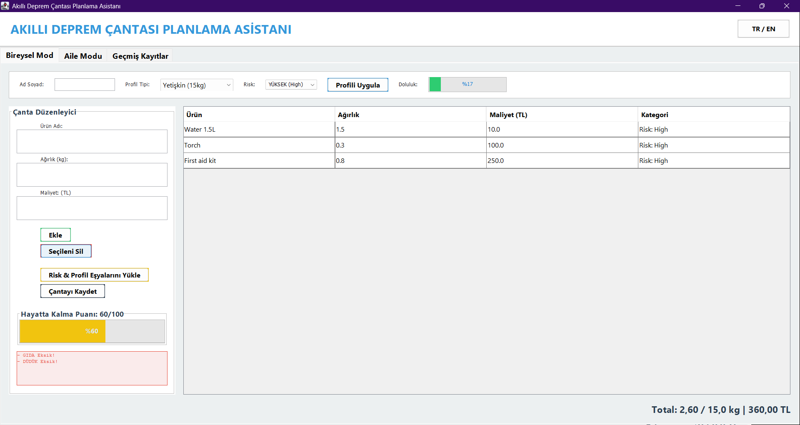
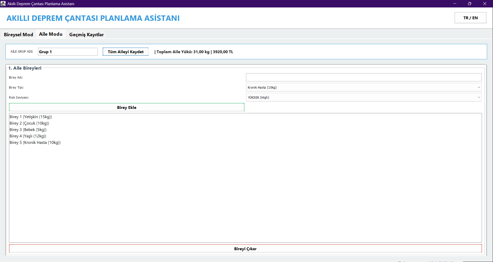

# 🎒 Smart Earthquake Bag Planning Assistant
### (Akıllı Deprem Çantası Planlama Asistanı)

<div align="center">


</div>

---

## 📖 Proje Özeti (Project Summary)

**Akıllı Deprem Çantası Planlama Asistanı**, bireylerin ve ailelerin afet hazırlık süreçlerini bilimsel, sistematik ve bütçe dostu bir şekilde yönetmelerini sağlayan kapsamlı bir Java masaüstü uygulamasıdır. 

AFAD standartlarına uygun olarak geliştirilen bu proje; **MVC (Model-View-Controller)** mimarisi üzerine inşa edilmiş olup, kullanıcıya risk seviyesine göre rehberlik eder, ağırlık optimizasyonu yapar ve "Hayatta Kalma Skoru" hesaplar.

---

## 🎯 Projenin Amacı (Project Goal)

Bu projenin temel amacı, hayati öneme sahip olan deprem çantası hazırlama sürecini **dijitalleştirmek**, **hatasız hale getirmek** ve **farkındalık yaratmaktır**. Uygulama, kullanıcının bulunduğu bölgenin risk seviyesine (Yüksek/Orta/Düşük) ve aile bireylerinin özel durumlarına (Bebek, Yaşlı, Kronik Hasta vb.) göre dinamik ve hayat kurtarıcı listeler oluşturur.

---

## 🏗️ Yazılım Mimarisi (Software Architecture)

Bu proje, sürdürülebilirlik ve test edilebilirlik için **Katmanlı Mimari (Layered Architecture)** prensiplerine göre tasarlanmıştır:

1.  **Presentation Layer (UI):** `Java Swing` kullanılarak geliştirilen kullanıcı arayüzü. Kullanıcı etkileşimlerini yönetir, iş mantığını bilmez.
2.  **Business Logic Layer (Service):** `BagService` sınıfı üzerinden hesaplamalar (Puanlama, Eksik Analizi, Oto-Yükleme) yönetilir.
3.  **Data Access Layer (Repository):** `Repository Pattern` kullanılarak veri saklama (TXT/File I/O) işlemleri soyutlanmıştır.
4.  **Model Layer:** `EmergencyBag`, `Item`, `FamilyMember` gibi temel veri yapıları ve OOP prensipleri (Encapsulation, Polymorphism) burada bulunur.

---

## 🚀 Temel Özellikler (Key Features)

### 1. 👥 Gelişmiş Profil ve Risk Yönetimi
* **Risk Bazlı Planlama:** Bölgenin deprem riskine göre (Yüksek, Orta, Düşük) otomatik olarak su ve gıda stoklarını ayarlar.
* **Akıllı Kategoriler:**
  * **Bebek:** Bez, mama, ıslak mendil gibi özel ihtiyaçlar otomatik eklenir.
  * **Yaşlı:** İlaç kutusu, baston, yedek gözlük gibi gereksinimler otomatik eklenir.
  * **Kronik Hasta:** İlaçlar, reçete kopyaları ve yedek piller listeye dahil edilir.
* **Aile Modu:** Tüm aile bireylerini tek ekranda yönetme ve toplam aile yükünü hesaplama.

### 2. 🧠 Akıllı Analiz Algoritmaları
* **Hayatta Kalma Skoru (Survival Score):** Çantadaki kritik ürünleri (Su, Gıda, Işık, İlk Yardım, Düdük) analiz ederek **0-100 arası** bir hazırlık puanı verir.
* **Akıllı Eksik Tespiti:** Çantada hayati öneme sahip eksikleri (Örn: *"Düdük yok!", "Su yetersiz!"*) anlık olarak tespit eder ve kullanıcıyı uyarır.
* **Dinamik Kapasite Kontrolü:** Her profilin taşıyabileceği maksimum ağırlığı (Weight Limit) anlık olarak denetler.

### 3. 💰 Bütçe ve Maliyet Takibi
* Eklenen her ürünün tahmini maliyeti girilerek, bireysel ve toplam aile çantasının maliyeti hesaplanır. Afet hazırlığının bütçeye etkisi anlık olarak takip edilebilir.

### 4. 🌍 Çoklu Dil Desteği & UX
* **TR / EN Desteği:** Tek tıkla Türkçe ve İngilizce arayüz arasında geçiş (Para birimleri TL / $ olarak otomatik güncellenir).
* **Modern Arayüz (GUI):** Renk kodlu ilerleme çubukları (Progress Bars), sekmeli yapı ve hata yönetimi (Exception Handling) içeren kullanıcı deneyimi.

### 5. 💾 Veri Yönetimi ve Raporlama
* **Geçmiş Kayıtlar:** Oluşturulan tüm bireysel ve aile planları tarihçesiyle birlikte saklanır.
* **TXT Dışa Aktarım:** Hazırlanan listeler `.txt` formatında bilgisayara indirilip çıktı alınabilir.

---

## 🛠️ Kullanılan Teknolojiler (Tech Stack)

| Alan | Teknolojiler |
| :--- | :--- |
| **Dil** | Java (JDK 8+) |
| **Arayüz (GUI)** | Java Swing (JFrame, JTable, Custom Renderers) |
| **Mimari** | MVC, Layered Architecture, Repository Pattern |
| **OOP Prensipleri** | Inheritance, Polymorphism, Encapsulation, Abstraction |
| **Veri Yapıları** | Collections Framework (ArrayList, HashMap, List) |
| **Araçlar** | Eclipse IDE, Git & GitHub |

---

## 💻 Kurulum ve Kullanım (Installation & Usage)

Bu projeyi kendi bilgisayarınızda çalıştırmak için aşağıdaki adımları izleyin:

### Gereksinimler
* Bilgisayarınızda **Java Development Kit (JDK 8 veya üzeri)** kurulu olmalıdır.

### Adım 1: Projeyi Klonlayın
Terminal veya Komut Satırını açın ve şu komutu yazın:
```bash
git clone [https://github.com/DioBey7/Smart-Earthquake-Bag-Assistant.git](https://github.com/DioBey7/Smart-Earthquake-Bag-Assistant.git)
```

### Adım 2: IDE ile Açın
1. Eclipse veya IntelliJ IDEA'yı açın.

2. File > Open Project (veya Import Project) menüsünden indirdiğiniz klasörü seçin.

3. Projenin src klasörünün "Source Folder" olarak işaretlendiğinden emin olun.

### Adım 3: Çalıştırın
1. Proje gezgininde src/com/beyza/earthquake/ui/MainGUI.java dosyasını bulun.

2. Dosyaya sağ tıklayıp Run As > Java Application seçeneğine tıklayın.

3. Açılan pencerede dil seçimi yapıp (TR/EN) çantanızı hazırlamaya başlayabilirsiniz!


## 📸 Ekran Görüntüleri (Screenshots)

<div align="center">
  
  
  
  
  
  
</div>

## 📈 Geliştirme Süreci (Development Journey)
Bu proje, yazılım geliştirme yaşam döngüsünü (SDLC) simüle etmek amacıyla iteratif bir yaklaşımla geliştirilmiştir:

1. v1.0 (Konsol): Temel Java sınıfları (Item, Bag, FamilyMember) ve mantıksal katman oluşturuldu.

2. v2.0 (Temel GUI): Swing kütüphanesi ile kullanıcı arayüzü eklendi, veri girişi sağlandı.

3. v3.0 (Refactoring & Mimari): Kod yapısı MVC prensibine göre Service, Repository, Model ve UI paketlerine ayrılarak modüler hale getirildi.

4. v4.0 (Algoritma Entegrasyonu): "Hayatta Kalma Skoru" ve "Akıllı Eksik Tespiti" algoritmaları sisteme entegre edildi.

5. Final: Risk seviyelerine göre otomatik eşya atama, kategoriye özel ihtiyaçlar (Bebek/Yaşlı), bütçe takibi ve estetik iyileştirmeleri ile proje tamamlandı.

## 🤝 İletişim
Geliştirici: Beyza Yazıcı

Proje ile ilgili öneri, katkı veya sorularınız için bana ulaşabilirsiniz:

- LinkedIn: www.linkedin.com/in/beyza-yazıcı-400183332
- Email: beyza04yazici2005@gmail.com
- GitHub: https://github.com/DioBey7

Bu proje, afet bilincini artırmak ve yazılım mühendisliği yetkinliklerini sergilemek amacıyla açık kaynak olarak geliştirilmiştir.
